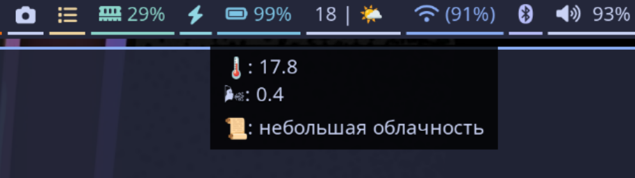

# wb-current-weather
[](https://github.com/devalv/wb-current-weather/actions/workflows/github-code-scanning/codeql)

## Отображение текущей погоды


## Установка и конфигурация
Результатом работы будет отображение текущего прогноза погоды для выбранного города.
Данные будут получены от [OpenWeather](https://openweathermap.org/current#cityid), с помощью API v2.5
(https://api.openweathermap.org/data/2.5/weather?id={city id}&appid={API key}&units={units}&lang={lang})
Перед началом работы Вам необходимо найти ID города [тут](https://bulk.openweathermap.org/sample/) и получить собственный API-ключ для обращения к API.

### Установка собранного bin-файла
1. Загрузите соответствующую версию из раздела [релизы](https://github.com/devalv/wb-current-weather/releases)
2. Скопируйте исполняемый файл в /usr/local/bin (или иной каталог доступный waybar на запуск) или установите deb-пакет
3. Создайте файл-конфигурации по инструкции описанной ниже
4. Проверьте запуск командой `wb-current-weather -config /home/user/.config/wb-current-weather.yml`
5. Если на 4м шаге произошли ошибки - активируйте ключ debug в config.yml и повторите запуск
6. Добавьте отображение статуса в waybar (инструкция ниже)

### Содержимое конфигурационного файла приложения (config.yml)
```
debug: false
city_id: 498817
weather_api_token: "you-api-key"
units: "metric"
lang: "ru"
```

#### Параметры по-умолчанию:
    units - metric
    lang  - ru
    city_id - 524305 (Мурманск)

### Добавление запуска в waybar (~/.config/waybar/config.jsonc)
1. Добавьте отображение вывода в раздел **modules-right** (или иной)
```json
"modules-right": [
    ...
    "battery",
    "custom/wbcw",
    ...
],
```
2. Добавьте обработчик вывода
```json
    ...
   "custom/wbcw": {
     "exec" : "wb-current-weather -config /home/user/.config/wb-current-weather.yml",
    "return-type": "json",
    "interval": 300,
     "format": "{}"
    },
    "battery": {
        "format": "{icon} {capacity}%",
        "format-icons": ["", "", "", "", ""]
    },
    ...
```

### Настройка отступов для waybar (~/.config/waybar/style.css)
```css
#custom-wbcw {
    color: @text;
    padding-right: 13px;
 }
```

## Сборка deb-пакета

По релизному тегу настроена автосборка и публикация в артефакты релиза на github.

### Локальная проверка сборки
```bash
make build-deb VERSION=0.2.2
```
